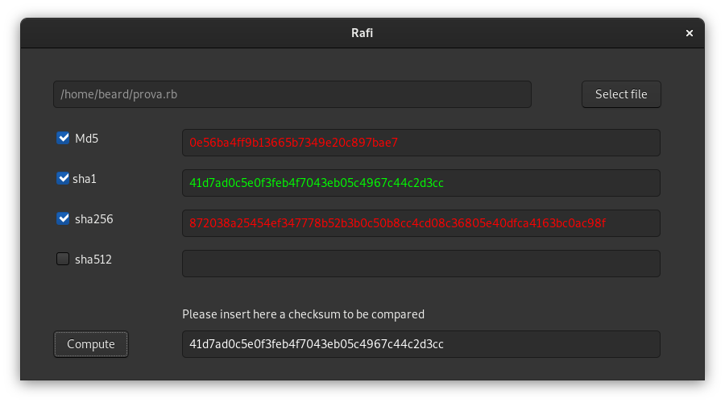

# RAFI

## What is RAFI
RAFI (*Ruby Application [for] File Integrity*) is a simple application written in Ruby using the GTK+ bindings to control the checksums of a file. 
It can be used in two different ways:
* **Checksum calculator**:
Once you've selected the file and checked one (or more) checksums the application shows the results in the specific text entries

* **Checksum comparison**:
You can enter a checksum in the dedicated textbox and control if it matches one of the calculated hashes, to ensure the file integrity

## How to use it
In order to use RAFI you've to:
* Have `ruby` and the `gtk3` gem installed on your system
* Clone/download this repository
* Make the main file (`rafi`) executable
* Execute it `./rafi`
